<h1>
  
   project-management</h1>
  <p>


<p align="center">
  <b>Build fast, scalable, and interactive web apps effortlessly.</b>  
  <br />
  An open-source project management platform built with ReactJS, Tailwind CSS, Node.js, Prisma, and Postgres (Neon).
</p> 


---

## 🧩 Overview

**project-management 🚀** is a **modern open-source project management platform** crafted for teams.  
Manage **workspaces, tasks, analytics, and users** in one streamlined dashboard.

🔗 **Live Demo:** [Project Managment](https://project-management-oyk2.vercel.app/)

<div style="display: flex; flex-wrap: wrap; justify-content: center; gap: 15px; padding: 20px; background-color: #f8f9fa;">
  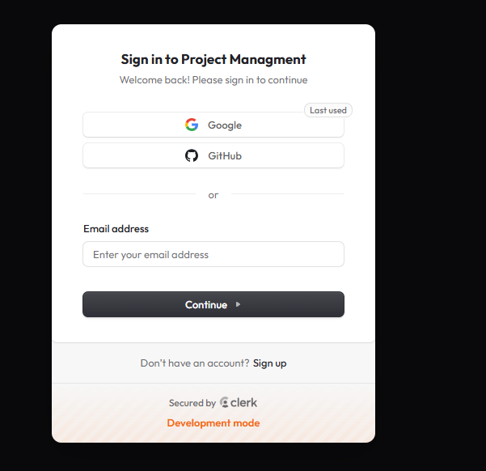
  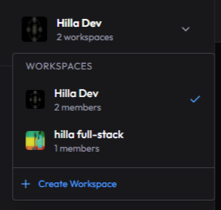
  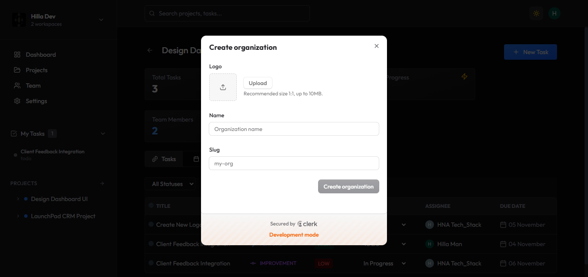
  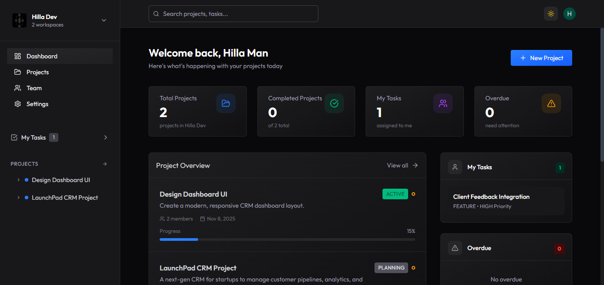
  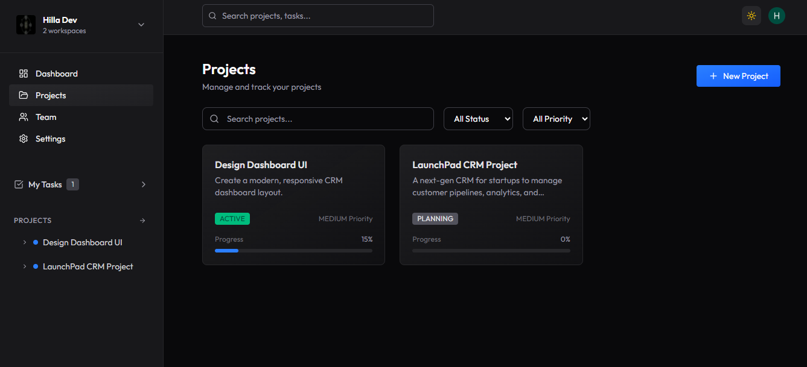
  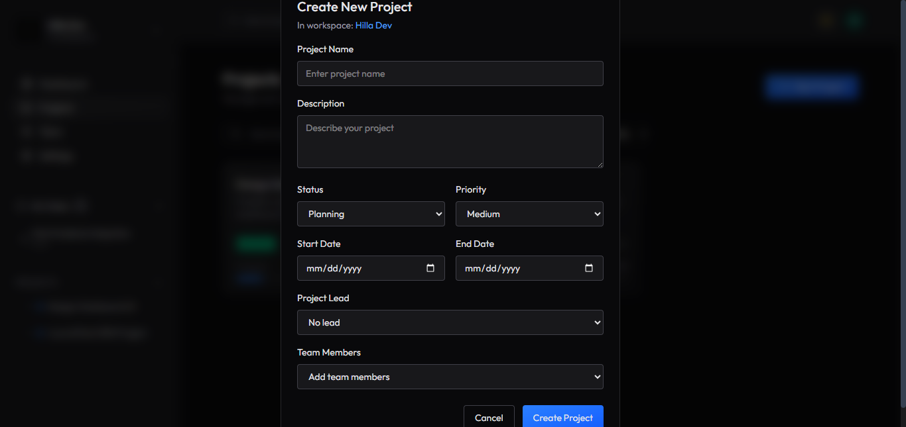
  
  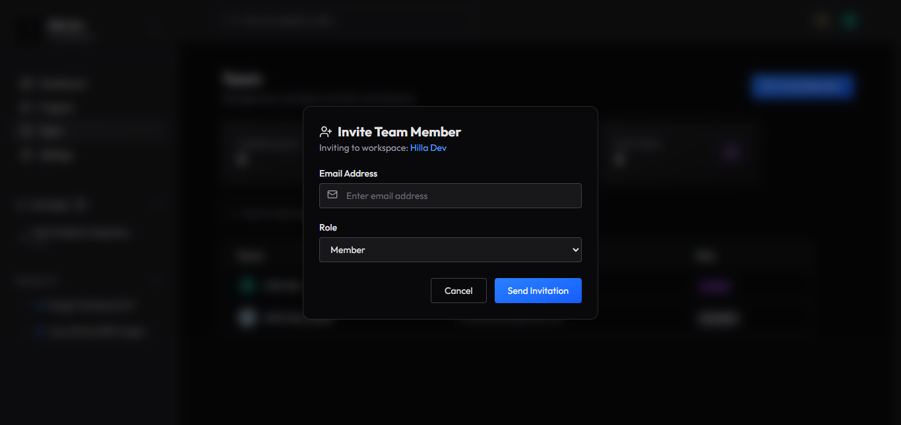
  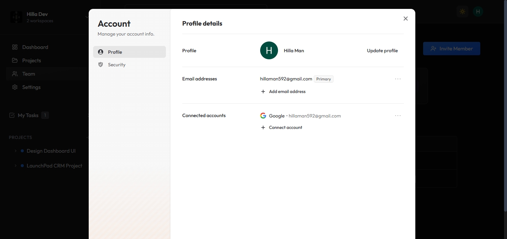
  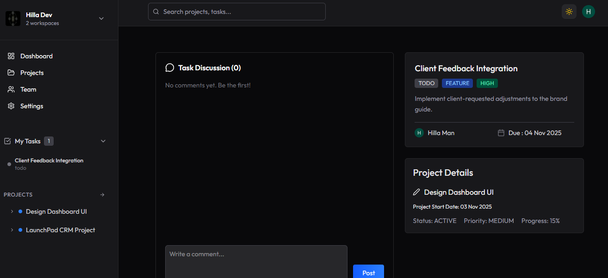
  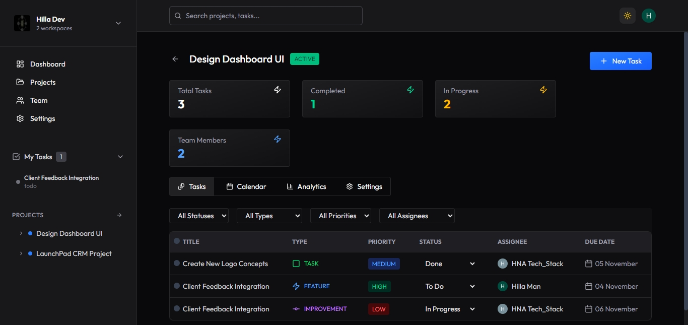
  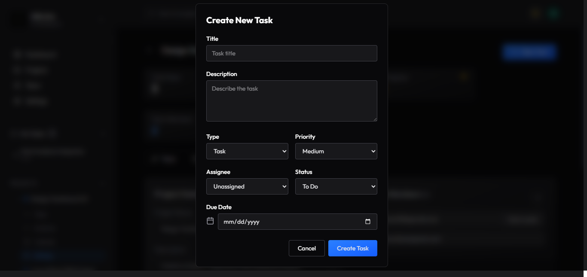
  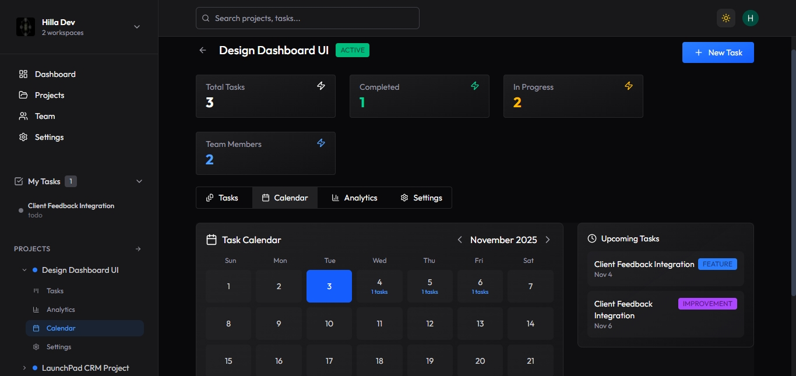
  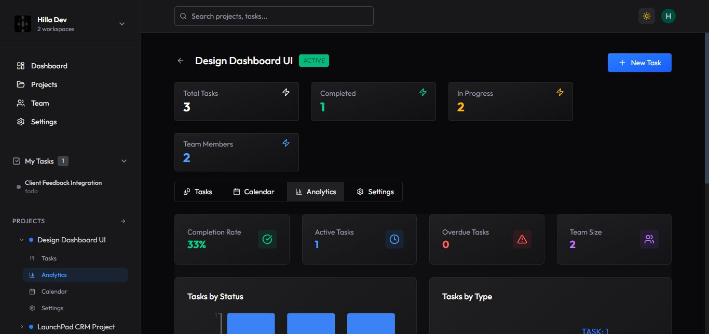
  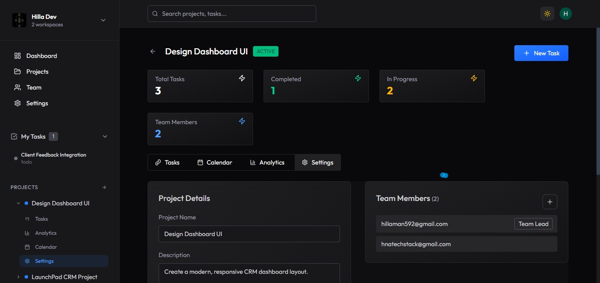
---

## 📖 Table of Contents

- [✨ Features](#-features)
- [🛠️ Tech Stack](#-tech-stack)
- [🚀 Getting Started](#-getting-started)
- [🤝 Contributing](#-contributing)
- [📜 License](#-license)
- [📜 Author](#-author)

---

## ✨ Features <a name="-features"></a>

| Category                | Highlights                                   |
| ----------------------- | -------------------------------------------- |
| 🔐 **Authentication**   | Secure login with [Clerk](https://clerk.com) |
| 🎨 **UI/UX**            | Responsive design with Tailwind CSS          |
| 🧭 **Navigation**       | SPA routing using React Router               |
| ⚡ **API**              | RESTful backend built with Express           |
| 🧩 **Data Management**  | CRUD via Prisma ORM + Postgres               |
| 📊 **Analytics**        | Visualized insights powered by Recharts      |
| 🧑‍💼 **Workspaces**       | Manage projects, tasks, and teams            |
| 💬 **User Roles**       | Role-based access control                    |
| 🚀 **Deployment Ready** | Configured for Vercel & Neon                 |

---

## 🛠️ Tech Stack <a name="-tech-stack"></a>

| Layer        | Stack                                              |
| ------------ | -------------------------------------------------- |
| **Frontend** | React, Tailwind CSS, React Router, Redux, Recharts |
| **Backend**  | Node.js, Express                                   |
| **Database** | Prisma ORM, PostgreSQL (Neon)                      |
| **Auth**     | Clerk                                              |

---

## ⚙️ Get Started <a name="-getting-started"></a>

Make sure you have **Node.js** (v18+) and **npm** or **yarn** installed.

```bash
git clone https://github.com/hilla10/project-management.git

cd project-management

# Start backend
cd server
pnpm install
npm run dev

# Start frontend
cd client
npm start

```

### 🗂 Folder Structure

```bash
project-management/
├── client/            # React frontend
│   ├── src/
│   └── public/
├── server/            # Node.js backend
│   ├── routes/
│   └── controllers/
├── prisma/            # Prisma schema & migrations
├── .env               # Environment variables
└── README.md
```
## 🤝 Contributing <a name="-contributing"></a>

Contributions are welcome and greatly appreciated 💙

1, Fork the repository

2, Create a new branch:
```bash
git checkout -b feature/YourFeature
```

3, Commit your changes:

```bash

git commit -m "Add new feature"
```

4, Push The Branch

```bash
git push origin feature/YourFeature
```

## 📜 License <a name="-license"></a>

This project is licensed under the MIT License. See the [LICENSE.md](./LICENSE.md) file for details.

###👋 Author & Contact <a name="-author"></a>

👨‍💻 Hailemichael Negusse

🌐 https://portfolio-rho-gules-15.vercel.app/

💻 https://github.com/hilla10

```
⭐ If you like this project, give it a star on GitHub!
It helps others discover it and keeps the project growing. 🌟
```
